# PPS-Unidad3Actividad2-Cristian

## Índice

- [PPS-Unidad3Actividad2-Cristian](#pps-unidad3actividad2-cristian)
  - [Índice](#índice)
  - [Actividad 1 - Recolección de Información y Análisis de Vulnerabilidades](#actividad-1---recolección-de-información-y-análisis-de-vulnerabilidades)
    - [1. 📡 **Obtención de Información Pública**](#1--obtención-de-información-pública)
      - [WHOIS](#whois)
      - [Web DomainTools](#web-domaintools)
      - [DNSrecon](#dnsrecon)
    - [2. **🔎 Escaneo con Nmap y Nikto**](#2--escaneo-con-nmap-y-nikto)
      - [Nmap](#nmap)
        - [*Detección de puertos y servicios:*](#detección-de-puertos-y-servicios)
        - [*Escaneo de vulnerabilidades:*](#escaneo-de-vulnerabilidades)
        - [*Escaneo de sistema operativo:*](#escaneo-de-sistema-operativo)
      - [Nikto](#nikto)
    - [3. **📁 Fuerza Bruta y Enumeración de Recursos Web**](#3--fuerza-bruta-y-enumeración-de-recursos-web)
      - [Wfuzz](#wfuzz)
        - [*Enumerar directorios*:](#enumerar-directorios)
        - [*Fuzzing de parámetros GET*:](#fuzzing-de-parámetros-get)
      - [Dirb](#dirb)
    - [4. **⚙️ Scripts de Nmap para Vulnerabilidades**](#4-️-scripts-de-nmap-para-vulnerabilidades)
    - [5. **💣 Búsqueda de Exploits con SearchSploit**](#5--búsqueda-de-exploits-con-searchsploit)
  - [Actividad 2 - Herramienta de Shodan](#actividad-2---herramienta-de-shodan)
  - [Actividad 3 - Práctica con el laboratorio](#actividad-3---práctica-con-el-laboratorio)
    - [1. Locación de IP y puertos de las máquinas](#1-locación-de-ip-y-puertos-de-las-máquinas)
    - [2. Identificación de equipos en la red](#2-identificación-de-equipos-en-la-red)
    - [3. Escaneo de los puertos en la red](#3-escaneo-de-los-puertos-en-la-red)
    - [4. Escaneo de servicios y SO](#4-escaneo-de-servicios-y-so)
    - [5. Inspección de puertos con Nikto](#5-inspección-de-puertos-con-nikto)
    - [6. Buscar vulnerabilidades con scripts de Nmap](#6-buscar-vulnerabilidades-con-scripts-de-nmap)
    - [7. Localizar servicios y rutas web](#7-localizar-servicios-y-rutas-web)
    - [8. Búsqueda con searchsploit](#8-búsqueda-con-searchsploit)

---

## Actividad 1 - Recolección de Información y Análisis de Vulnerabilidades

### 1. 📡 **Obtención de Información Pública**

#### WHOIS

El protocolo WHOIS permite obtener información sobre la propiedad y administración de dominios.

El comando básico sería:
```bash
whois ejemplo.com
```

<p align="center">
  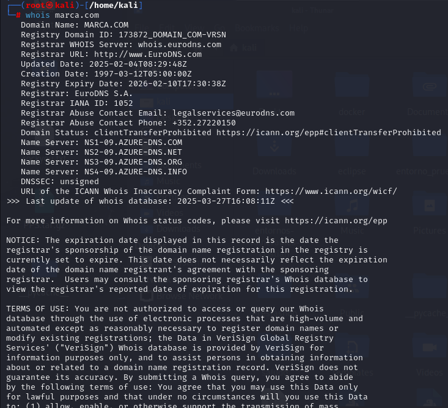
</p>
<p align="center"><em>Ejemplo ejecución comando WHOIS sobre la página marca.com</em></p>

La información que obtendríamos sería:
- Registrante del dominio
- Fechas de creación y expiración
- Servidores DNS
- Datos del registrador

#### Web DomainTools

[DomainTools](https://whois.domaintools.com/) es  una plataforma online que ofrece:
- Historial de WHOIS
- DNS pasivo
- IPs relacionadas
- Información de hosting

<p align="center">
  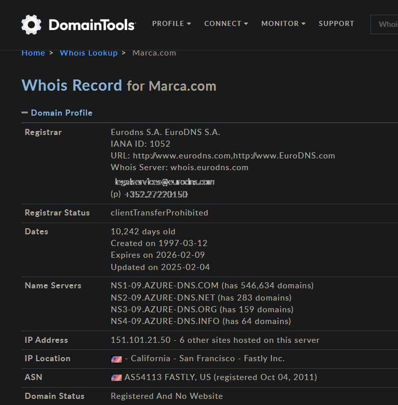
</p>
<p align="center"><em>Ejemplo Búsqueda de la página marca.com en DomainTools</em></p>

#### DNSrecon

Herramienta de recolección de información DNS. Para su instalación deberíamos clonar el repositorio y utilizar `python` para ejecutarlo:
```bash
git clone https://github.com/darkoperator/dnsrecon.git
cd dnsrecon
python3 dnsrecon.py -h
```

El ejemplo de comando básico sería:
```bash
python3 dnsrecon.py -d ejemplo.com
```

Algunos parámetros útiles con los que cuenta serían:

- ``-t std``: Recolecta registros estándar (A, NS, MX, SOA, etc.)
- ``-a``: Realiza todas las pruebas disponibles
- ``-D subdominios.txt -t brt``: Fuerza descubrimiento de subdominios

### 2. **🔎 Escaneo con Nmap y Nikto**

#### Nmap

Nmap permite descubrir hosts, puertos y servicios en una red.

##### *Detección de puertos y servicios:*
```bash
nmap -sS -sV -T4 -Pn 192.168.1.1
```
- `-sS` → Escaneo TCP SYN (no establece conexión completa, usa paquetes RST).
- ``-T4`` → Velocidad de escaneo: ajusta el "timing" del escaneo. T4 es agresivo pero razonablemente confiable en redes rápidas. Va desde T0 (más lento y sigiloso) hasta T5 (muy rápido, más detectable).
- ``-Pn`` → No hacer ping (No ping): omite la detección de host en línea. Asume que el host está activo. Útil si el firewall bloquea ICMP (ping) o si estás seguro de que el objetivo está vivo.

##### *Escaneo de vulnerabilidades:*
```bash
nmap --script vuln 192.168.1.1
```
- ``--script vuln`` → Usa los scripts NSE (Nmap Scripting Engine) categorizados como "vuln" para detectar vulnerabilidades conocidas en los servicios expuestos. Esto puede incluir:
  - Fallas en SMB, FTP, HTTP, etc.
  - Problemas de configuración o versiones vulnerables.

##### *Escaneo de sistema operativo:* 
```bash
nmap -O 192.168.1.1
```
- ``-O`` → Detección del sistema operativo: intenta determinar el sistema operativo del host objetivo basándose en el comportamiento de la pila TCP/IP.

<p align="center">
  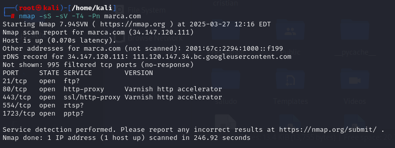
</p>
<p align="center"><em>Ejemplo de escaneo básico de puertos sobre la página marca.com con Nmap</em></p>

#### Nikto

Analizador de servidores web que busca vulnerabilidades comunes. El comando básico sería:
```bash
nikto -h http://ejemplo.com
```

<p align="center">
  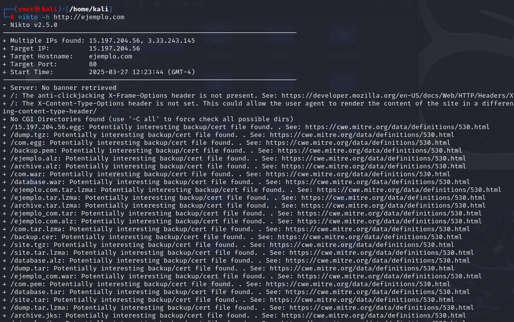
</p>
<p align="center"><em>Ejemplo de escaneo básico con Nikto</em></p>

Algunas de las opciones más útiles con las que cuenta serían:
- ``-Tuning``: Ajuste de pruebas
- ``-ssl``: Para HTTPS


### 3. **📁 Fuerza Bruta y Enumeración de Recursos Web**

#### Wfuzz

Herramienta para pruebas de fuzzing de aplicaciones web.

##### *Enumerar directorios*:

```bash
wfuzz -c -z file,/usr/share/wordlists/dirb/common.txt --hc 404 http://objetivo.com/FUZZ
```
  - `-c`: Salida en color.
  - `-z file,<ruta_lista>`: Utiliza un diccionario de palabras.
  - `--hc 404`: Oculta respuestas con código 404 (no encontrado).
  - `FUZZ`: Indica la posición en la URL donde se insertará cada palabra del diccionario.

##### *Fuzzing de parámetros GET*:
```bash
wfuzz -c -w wordlist.txt -u http://ejemplo.com/page.php?FUZZ=test
```
- `-w`: Para utilizar un diccionario

<p align="center">
  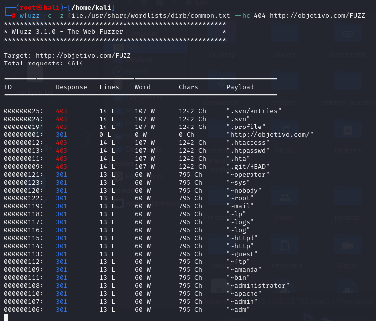
</p>
<p align="center"><em>Ejemplo de fuzzing básico con Wfuzz</em></p>

#### Dirb

Explorador web simple para encontrar directorios ocultos.

- Uso básico:
```bash
dirb http://ejemplo.com
```
- Uso con wordlist personalizada:
```bash
dirb http://ejemplo.com /ruta/a/wordlist.txt
```

<p align="center">
  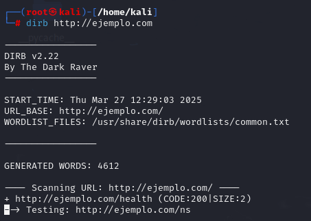
</p>
<p align="center"><em>Ejemplo de fuzzing básico con Dirb</em></p>

### 4. **⚙️ Scripts de Nmap para Vulnerabilidades**

Nmap incluye el NSE (Nmap Scripting Engine) con muchos scripts útiles.

- Listado de scripts relacionados con vulnerabilidades:
```bash
ls /usr/share/nmap/scripts/*vuln*
```

- Ejemplos comunes:
```bash
nmap --script http-vuln-cve2006-3392 -p 80 ejemplo.com
nmap --script smb-vuln-ms17-010 -p 445 192.168.1.1
```

- Buscar scripts por palabra clave:
```bash
locate *smb* | grep nse
```

<p align="center">
  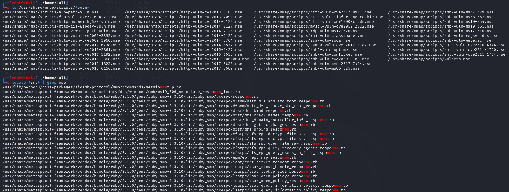
</p>
<p align="center"><em>Ejemplos de búsquedas de scripts de Nmap</em></p>

### 5. **💣 Búsqueda de Exploits con SearchSploit**

SearchSploit es parte del proyecto Exploit-DB y permite buscar exploits localmente.

- Buscar una vulnerabilidad:
```bash
searchsploit apache 2.4
```

- Ver detalles del exploit:
```bash
searchsploit -x exploits/linux/remote/12345.txt
```

- Copiar exploit al directorio actual:
```bash
searchsploit -m exploits/linux/remote/12345.txt
```

- Actualizar base de datos:
```bash
searchsploit -u
```

<p align="center">
  
</p>
<p align="center"><em>Ejemplos de búsquedas de exploits de Exploit-DB con searchsploit</em></p>

---

## Actividad 2 - Herramienta de Shodan

**Shodan** es un motor de búsqueda para dispositivos conectados a Internet. A diferencia de Google, que indexa sitios web, Shodan indexa **servicios** y **dispositivos**: cámaras IP, routers, servidores, sistemas SCADA, IoT, etc.
- Buscar dispositivos expuestos en internet.
- Identificar servicios inseguros o mal configurados (como bases de datos abiertas o puertos peligrosos).
- Hacer reconocimiento pasivo en ciberseguridad.
- Ver qué tecnología utiliza un sitio o servidor.
- Investigar amenazas o vulnerabilidades públicas.

Para obtener la extensión debemos:
1. Ir a la Chrome Web Store: https://chrome.google.com/webstore
2. Buscar: Shodan
3. Hacer clic en "Instalar extensión".

<p align="center">
  
</p>
<p align="center"><em>Uso de la extensión Shodan</em></p>

La información principal que nos aporta en este caso es:

- **Dirección IP pública**: ``178.255.108.26``
- **Hostname(s)**: ``educarex.es``. Esto indica que el servidor está relacionado con el dominio principal educarex.es, probablemente gestionado por la Consejería de Educación (Extremadura).
- Puertos abiertos detectados:
    - ``80`` → Puerto estándar para HTTP (sitios web sin cifrado).
    - ``443`` → Puerto estándar para HTTPS (sitios web cifrados con SSL/TLS).

Para obtener más información podríamos dar a `View IP details` o `View Domain Details` y nos redirigirá a la información de la ip en la página de [Shodan](https://www.shodan.io/), en la que debemos estar registrados con correo electrónico para obtener la información.

---

## Actividad 3 - Práctica con el laboratorio

### 1. Locación de IP y puertos de las máquinas

Visualizando el ``docker-compose`` que crea las máquinas podemos obtener esta información:

- Servicio ``dvwa_web``
  - **Imagen**: cytopia/dvwa
  - **Puerto mapeado**: ``8002`` (externo) → ``80`` (interno en el contenedor)

- Servicio ``bwapp``
  - **Imagen**: feltsecure/owasp-bwapp
  - **Puerto mapeado**: ``8001`` (externo) → ``80`` (interno en el contenedor)

- Servicio ``multidillae``
  - **Imagen**: webpwnized/mutillidae:www
  - **Puerto mapeado**: ``8080`` (externo) → ``80`` (interno en el contenedor)

### 2. Identificación de equipos en la red

Mediante el siguiente comando se ha realizado un escaneo de tipo **ping scan** (descubrimiento de hosts activos) sobre toda la red:

```bash
nmap -sn 172.19.0.1/16
```
- ``-sn``: Solo hace descubrimiento de hosts activos (ping scan), sin escanear puertos.

<p align="center">
  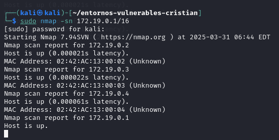
</p>
<p align="center"><em>Escaneo de la red para identificar los hosts de la misma</em></p>

### 3. Escaneo de los puertos en la red

Mediante el siguiente comando se ha realizado un **escaneo de puertos** de todos los host en la red:

```bash
nmap -sS -p- -sV 172.19.0.1/16
```
- ``-sS``: Realiza un escaneo TCP SYN (tambien conocido como "half-open" scan). Es rápido y menos ruidoso.
- ``-p-``: Escanea todos los puertos TCP (del 1 al 65535).
- ``-sV``: Intenta determinar la versión del servicio que se ejecuta en los puertos abiertos.

<p align="center">
  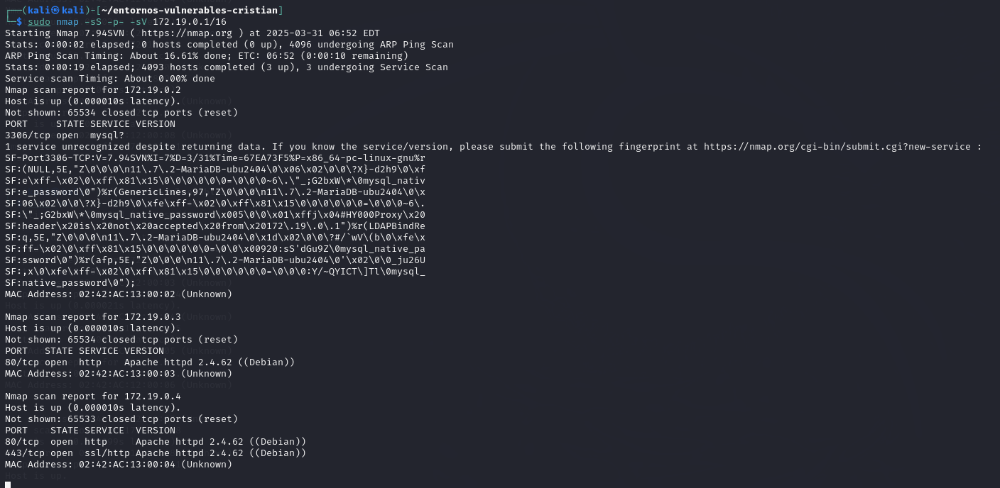
</p>
<p align="center"><em>Escaneo de la red para identificar los puertos abiertos de los hosts de la misma</em></p>

Como vemos en la captura están saliendo las máquinas correspondientes a uno de los servicios. Estas máquinas se comunican entre ellas para formar uno de los laboratorios vulnerables que utilizamos (Multidillae). Encontramos:

- El host ``172.19.0.2`` es la base de datos cuyo puerto es el ``3306``.
- El host ``172.19.0.3`` parece ser el servicio para administrador con el puerto ``80``.
- El host ``172.19.0.4`` es la propia página con los puertos abiertos ``80`` y `443`.

### 4. Escaneo de servicios y SO

Mediante el siguiente comando se ha realizado un escaneo de los **servicios** y **sistemas operativos** de todos los host en la red:

```bash
nmap -sS -p- -sV 172.19.0.1/16
```
- ``-sS``: Realiza un escaneo TCP SYN (tambien conocido como "half-open" scan). Es rápido y menos ruidoso.
- ``-p-``: Escanea todos los puertos TCP (del 1 al 65535).
- ``-sV``: Intenta determinar la versión del servicio que se ejecuta en los puertos abiertos.
- ``-O``: Intenta identificar el sistema operativo del host.

<p align="center">
  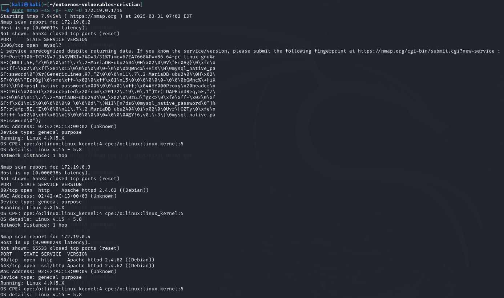
</p>
<p align="center"><em>Escaneo de la red para identificar servicios y SO de los hosts de la misma</em></p>

Como vemos en la captura están saliendo las máquinas correspondientes a uno de los servicios. Estas máquinas se comunican entre ellas para formar uno de los laboratorios vulnerables que utilizamos (Multidillae). Encontramos:

- Todos los hosts que aparecen en la captura cuentan con un SO de tipo *uso general*, Linux versión comprendida entre ``4.15-5.8`.

### 5. Inspección de puertos con Nikto

En este caso vamos a utlizar la herramienta Nikto, Nikto es una herramienta orientada a analizar servidores web, no escanea una red completa como Nmap. Para inspeccionar servicios con Nikto en una red, primero necesitamos identificar los hosts con puertos web abiertos, los cuales vimos anteriormente que eran el 80 y el 443 de las páginas. Por defecto, Nikto usa el puerto 80, si quieramos realizar el escaneo desde otro puerto podríamos utilizar el parámetro ``-port<Puerto>``

```bash
nikto -h 172.19.0.4
```
- Por defecto, Nikto usa el puerto ``80``, si quieramos realizar el escaneo desde otro puerto podríamos utilizar el parámetro ``-port<Puerto>``

<p align="center">
  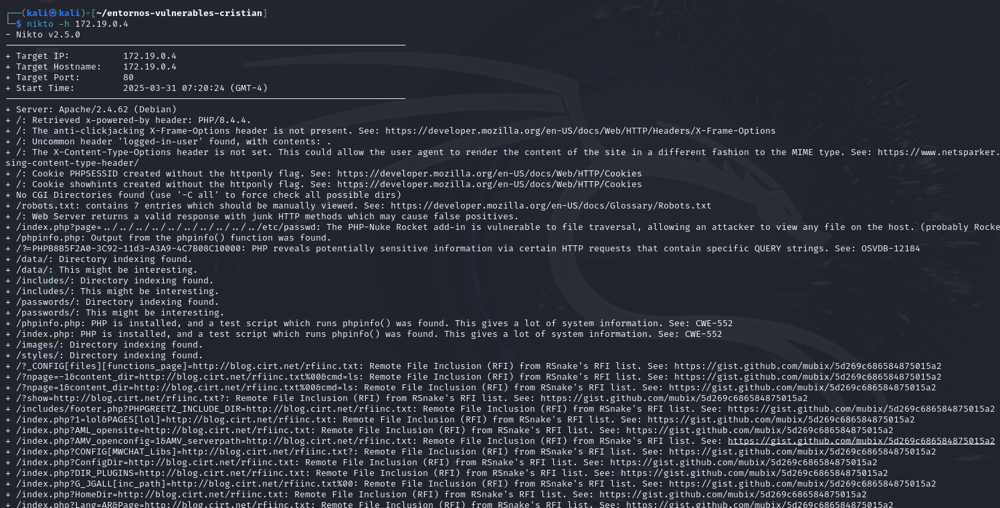
</p>
<p align="center"><em>Escaneo con Nikto usando el puerto 80</em></p>

Como vemos en la captura, Nikto nos ofrece información interesante sobre la página, tales como:
- **Cabeceras HTTP** que son vulnerables por parámetros mal configurados como `X-Frame-Options` o `X-Content-Type-Options`.
- **Cookies** susceptibles de XSS o sniffing.
- Archivo interesantes como `/robots.txt` o `/phpinfo.php`.
- Posibles ejemplos de **inclusión de ficheros** (LFI).
- Posibles vulnerabilidades encontradas, como la presencia de parámetros vulnerables a inyecciones remotas con referencias a listas de RSnake.
  - Por ejemplo: ``?page=1&content_dir=http://blog.cirt.net/rfiinc.txt``
- Divulgación de información sensible, como parámetros tipo ``PHPBB85F2A0...=PHP value``.

### 6. Buscar vulnerabilidades con scripts de Nmap

Mediante el siguiente comando se ha realizado un escaneo de **vulnerabilidades** con los scripts de la categoría ``vuln`` de Nmap:

```bash
nmap -sV --script vuln 172.19.0.0/16
```
- ``-sV``: Intenta determinar la versión del servicio que se ejecuta en los puertos abiertos.
- ``--script vuln``: Ejecuta una serie de scripts relacionados con vulnerabilidades conocidas.

<p align="center">
  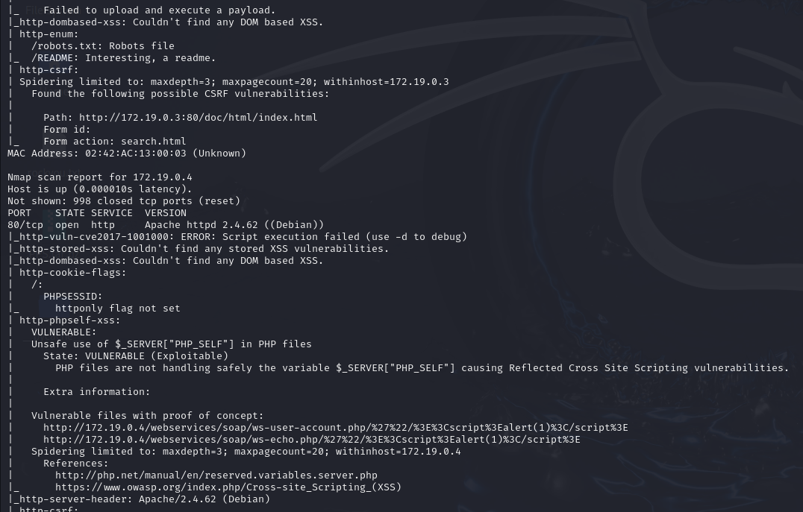
</p>
<p align="center"><em>Escaneo de vulnerabilidades con Nmap</em></p>

Como vemos en la captura se han ejecutado en todas las máquinas los script de la la categoría ``vuln``, tales como:

- ``http-enum``: Detecta recursos comunes como:
  - ``/robots.txt``: presente
  - ``/README``: archivo interesante

- ``http-csrf``: Detecta formularios vulnerables a CSRF
  - Encontrado en: ``/doc/html/index.html``
  - Acción del formulario: ``search.html``

- ``http-vuln-cve2017-1001000``: Falla al ejecutarse, necesita ``-d`` para depurar.

- ``http-stored-xss`` y ``http-dom-based-xss``: No encontraron vulnerabilidades.

- ``http-cookie-flags``:

  - Detecta que la cookie ``PHPSESSID`` no tiene el flag ``httponly``, lo que la hace vulnerable a ataques XSS.

- ``http-php-self-xss``: 
  - **Descripción**: Uso inseguro de $_SERVER["PHP_SELF"], lo que provoca un XSS reflejado.
  - **Estado**: VULNERABLE (Exploitable)
  - **Pruebas de concepto**:
    - ``http://172.19.0.4/webservices/soap/ws-user-account.php?...<script>alert(1)</script>``
    - ``http://172.19.0.4/webservices/soap/ws-echo.php?...<script>alert(1)</script>``

### 7. Localizar servicios y rutas web

Wfuzz es una herramienta de fuzzing que se puede usar para detectar servicios web, como páginas ocultas o rutas HTTP activas. Aunque Wfuzz no escanea redes completas, sí sirve para probar rutas en un host específico. Para ello podemos escoger una víctima y ejecutar el siguiente comando:

```bash
wfuzz -c -w /usr/share/wordlists/dirb/common.txt --hc 404 http://172.19.0.3/FUZZ
```
- ``-c``: Colorea la salida para que sea más legible.

- ``-w``: Wordlist que contiene nombres de rutas/directorios a probar.
  - Podemos usar ``/usr/share/wordlists/dirbuster/directory-list-2.3-medium.txt`` para algo más completo o, incluso, cualquier diccionario personalizado que tengamos.

- ``--hc 404``: Oculta respuestas con código **HTTP 404** (no encontrado).

- ``http://172.19.0.3/FUZZ``: URL objetivo con la palabra FUZZ, que es reemplazada por cada entrada de la wordlist.

<p align="center">
  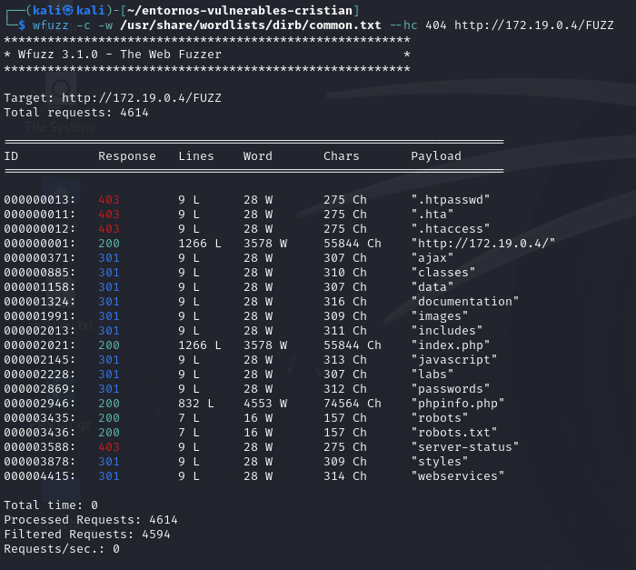
</p>
<p align="center"><em>Escaneo de rutas con Wfuzz</em></p>

En la captura vemos información relevante encontrada como la siguiente:

- Se enviaron **4,614 solicitudes** y se filtraron aquellas con código 404

- **Código 403 (Forbidden)**:
  - ``.htpasswd``, ``.hta``, ``.htaccess``, ``server-status``
  - Son archivos protegidos que el servidor no permite visualizar.

- **Código 200 (OK)**:
  - "``/``", ``index.php``, ``phpinfo.php`` => El contenido fue devuelto correctamente.

- **Código 301 (Redirección)**:

  - Directorios como: ``ajax``, ``classes``, ``data``, ``documentation``, ``images``, ``includes``, ``javascript``, ``labs``, ``passwords``, ``robots.txt``, ``styles``, ``webservices``.

  - Significa que esas rutas existen y están accesibles (redireccionan al usuario). Podrían llegar a ser posibles servicios de la página web.

- **Código 401/403 en archivos sensibles**:

  - Archivos ocultos y comunes en configuraciones web están presentes pero protegidos por el servidor.

### 8. Búsqueda con searchsploit

Se ha utilizado el siguiente comando para buscar vulnerabilidades relacionadas con el kernel de **Linux versión 5.x**:
```bash
searchsploit linux kernel 5
```

Este comando permite acotar los resultados a descripciones que incluyan las palabras "linux", "kernel" y "5", enfocando la búsqueda en vulnerabilidades específicas para esa versión del sistema.

<p align="center">
  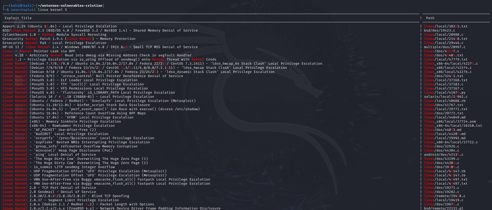
</p>
<p align="center"><em>Búsqueda de scripts con searchsploit</em></p>


Entre los resultados más destacados que obtendremos con la búsqueda, serán:

1. Linux Kernel 5.3
   - **Vulnerabilidad:** Privilege Escalation via `io_uring`
   - **Ruta:** `linux_x86-64/local/42275.c`
   - **Comentario:** Muy relevante. Usa `io_uring`, introducido en Kernel 5.1. Permite ejecución como root si es explotado correctamente.

2. Linux Kernel 5.3 / 5.4 / 5.8 / etc.
   - **Vulnerabilidad:** `ldso_hwcap Stack Clash` LPE
   - **Ruta:** `linux_x86/local/42274.c` y `42276.c`
   - **Comentario:** Afecta una gran variedad de distribuciones, incluyendo Debian, Ubuntu y Fedora. Explota el manejador dinámico de librerías.

3. Linux Kernel (Ubuntu 17.04)
   - **Vulnerabilidad:** `XFRM` Local Privilege Escalation
   - **Ruta:** `linux/local/44049.md`

4. Linux Kernel (x86_64)
   - **Vulnerabilidad:** Rowhammer Privilege Escalation
   - **Ruta:** `linux_x86-64/local/36310.txt`
   - **Comentario:** Técnica compleja que puede escribir en memoria protegida, requiere hardware compatible.

Dependiendo de lo que deseemos realizar en estos casos podremos realizar otro tipo de búsquedas para encontrar scripts que automaticen distintos procesos. Por ejemplo:

- Buscar solo escaladas de privilegios en Kernel 5:
```bash
searchsploit Linux Kernel 5 privilege escalation
```

- Buscar solo exploits locales en Kernel 5:
```bash
searchsploit Linux Kernel 5 local
```

- Si deseamos afinar aún más (con grep):
```bash
searchsploit Linux Kernel 5 | grep -i privilege
```
